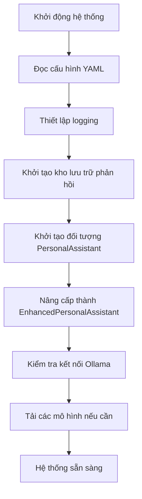
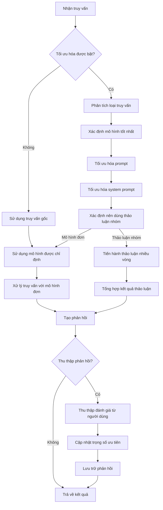
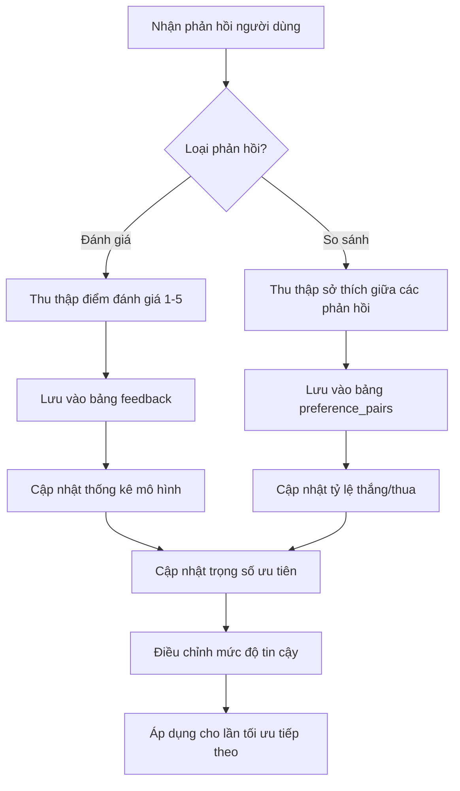
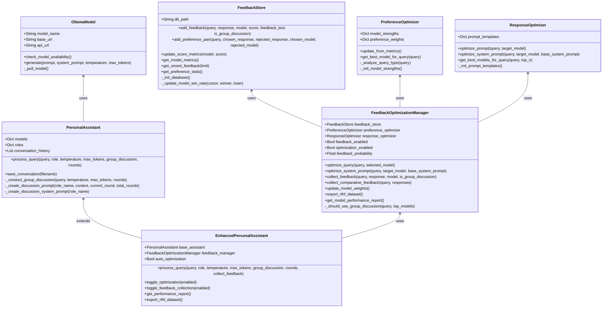
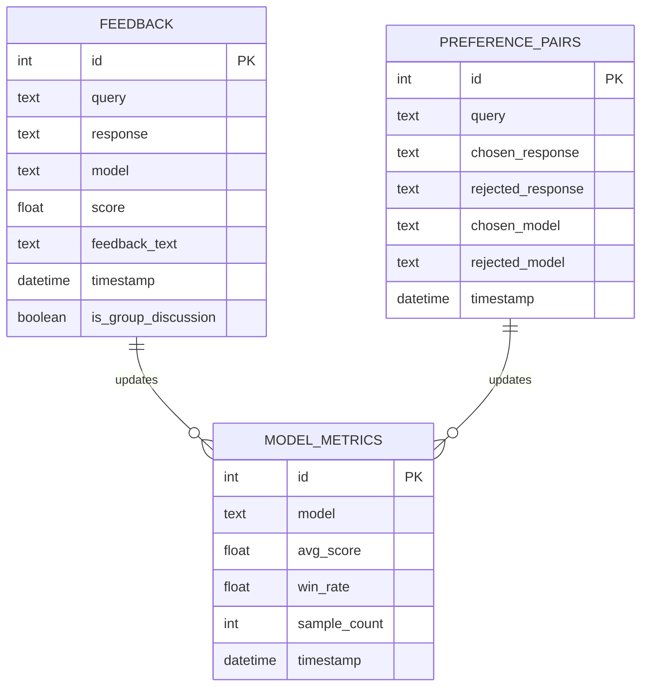

# Kiến trúc hệ thống hỗ trợ cá nhân với RLHF và DPO

## Cấu trúc thư mục

```
personal-assistant-rlhf/
│
├── src/                              # Thư mục mã nguồn chính
│   ├── core/                         # Lõi hệ thống
│   │   ├── __init__.py
│   │   ├── models.py                 # Quản lý mô hình Ollama
│   │   ├── assistant.py              # Hệ thống trợ lý cơ bản
│   │   └── group_discussion.py       # Thảo luận nhóm
│   │
│   ├── optimization/                 # Mô-đun tối ưu hóa RLHF/DPO
│   │   ├── __init__.py
│   │   ├── feedback_store.py         # Lưu trữ và quản lý phản hồi
│   │   ├── preference_optimizer.py   # Tối ưu hóa sở thích (DPO)
│   │   ├── feedback_collector.py     # Thu thập phản hồi (RLHF)
│   │   ├── response_optimizer.py     # Tối ưu hóa câu trả lời
│   │   └── manager.py                # Quản lý tối ưu hóa
│   │
│   ├── integration/                  # Tích hợp các thành phần
│   │   ├── __init__.py
│   │   ├── enhanced_assistant.py     # Trợ lý nâng cao với RLHF/DPO
│   │   └── interfaces.py             # Giao diện chung
│   │
│   ├── cli/                          # Giao diện dòng lệnh
│   │   ├── __init__.py
│   │   ├── argparser.py              # Xử lý tham số dòng lệnh
│   │   ├── interactive.py            # Chế độ tương tác
│   │   └── reporting.py              # Báo cáo hiệu suất
│   │
│   └── utils/                        # Các tiện ích
│       ├── __init__.py
│       ├── logging_setup.py          # Cấu hình logging
│       ├── prompt_templates.py       # Các mẫu prompt
│       └── export.py                 # Xuất dữ liệu RLHF
│
├── config/                           # Cấu hình
│   ├── default.yml                   # Cấu hình mặc định
│   ├── models.yml                    # Cấu hình mô hình
│   ├── optimization.yml              # Cấu hình tối ưu hóa
│   └── prompt_templates.yml          # Mẫu prompt cho từng loại câu hỏi
│
├── data/                             # Dữ liệu
│   ├── feedback.db                   # Cơ sở dữ liệu phản hồi
│   ├── conversations/                # Lịch sử hội thoại
│   └── rlhf_exports/                 # Dữ liệu RLHF xuất ra
│
├── tests/                            # Thử nghiệm
│   ├── unit/                         # Kiểm thử đơn vị
│   ├── integration/                  # Kiểm thử tích hợp
│   └── fixtures/                     # Dữ liệu thử nghiệm
│
├── docs/                             # Tài liệu
│   ├── architecture.md               # Tài liệu kiến trúc
│   ├── api.md                        # Tài liệu API
│   ├── rlhf_dpo.md                   # Giải thích RLHF/DPO
│   └── usage.md                      # Hướng dẫn sử dụng
│
├── scripts/                          # Các script
│   ├── setup.sh                      # Cài đặt môi trường
│   ├── export_rlhf.py                # Xuất dữ liệu RLHF
│   └── performance_report.py         # Tạo báo cáo hiệu suất
│
├── main.py                           # Điểm vào chính
├── setup.py                          # Cấu hình cài đặt
├── requirements.txt                  # Các phụ thuộc
├── README.md                         # Tài liệu tổng quan
└── LICENSE                           # Giấy phép
```

## Luồng xử lý

### 1. Luồng khởi động hệ thống



### 2. Luồng xử lý truy vấn với RLHF/DPO



### 3. Luồng thu thập và xử lý phản hồi (RLHF)



## File cấu hình YAML chính

```yaml
# config/default.yml
---
system:
  version: "1.0.0"
  log_level: "INFO"
  log_file: "logs/assistant.log"
  data_dir: "data"
  feedback_db: "data/feedback.db"
  conversation_dir: "data/conversations"
  rlhf_export_dir: "data/rlhf_exports"

ollama:
  base_url: "http://192.168.1.12:11434"
  timeout: 30  # Thời gian timeout (giây)
  retry_attempts: 3  # Số lần thử lại khi lỗi

assistant:
  default_max_tokens: 1024
  default_temperature: 0.7
  conversation_history_limit: 100  # Giới hạn lịch sử hội thoại

group_discussion:
  default_rounds: 2
  min_rounds: 1
  max_rounds: 5
  summarize_results: true
  add_confidence_scores: true

optimization:
  enabled: true
  auto_select_model: true
  check_group_discussion_suitability: true
  improve_system_prompt: true
  improve_user_prompt: true
  
  # Cấu hình RLHF
  feedback:
    enabled: true
    collection_probability: 0.3  # Xác suất yêu cầu phản hồi
    collect_comparisons: true
    min_samples_for_update: 5  # Số mẫu tối thiểu trước khi cập nhật
  
  # Cấu hình DPO
  preference:
    weight_update_factor: 0.1  # Hệ số cập nhật trọng số
    win_rate_weight: 0.7  # Trọng số của tỷ lệ thắng
    score_weight: 0.3  # Trọng số của điểm đánh giá
    default_weight: 1.0  # Trọng số mặc định
    min_weight: 0.5  # Trọng số tối thiểu
    max_weight: 2.0  # Trọng số tối đa

api:
  enabled: false  # Tính năng API (tương lai)
  port: 8000
  host: "127.0.0.1"
  auth_required: true
```

## File cấu hình mô hình

```yaml
# config/models.yml
---
models:
  - name: "qwen2.5-coder:7b"
    role: "code"
    system_prompt: >
      Bạn là trợ lý lập trình viên chuyên nghiệp. 
      Nhiệm vụ của bạn là viết mã nguồn chất lượng cao, cung cấp giải pháp 
      kỹ thuật, debugging và tối ưu hóa code. Hãy tập trung vào các 
      nguyên tắc clean code, hiệu suất, và bảo mật. Luôn cung cấp giải thích 
      chi tiết kèm theo mã nguồn.
    strengths:
      programming: 0.95
      algorithms: 0.90
      technical_explanation: 0.85
      math: 0.80
      problem_solving: 0.85
      language: 0.75

  - name: "deepseek-r1:8b"
    role: "deep_thinking"
    system_prompt: >
      Bạn là AI chuyên về tư duy phản biện và phân tích sâu.
      Hãy xem xét vấn đề từ nhiều góc độ, đánh giá các lập luận,
      phân tích logic, tìm ra các mâu thuẫn tiềm ẩn, và đưa ra các
      kết luận có cơ sở. Hãy áp dụng phương pháp tư duy hệ thống và
      suy nghĩ đa chiều để giải quyết các vấn đề phức tạp.
    strengths:
      analysis: 0.95
      critical_thinking: 0.90
      reasoning: 0.92
      evaluation: 0.88
      problem_solving: 0.85
      language: 0.80

  - name: "deepseek-r1:1.5b"
    role: "llm"
    system_prompt: >
      Bạn là trợ lý AI ngôn ngữ nhỏ gọn, tập trung vào việc trả lời
      nhanh chóng và hiệu quả. Hãy cung cấp thông tin ngắn gọn, súc tích
      và đi thẳng vào vấn đề. Ưu tiên độ chính xác và tốc độ.
      Bạn rất giỏi trong việc tóm tắt thông tin phức tạp thành
      những điểm chính dễ hiểu.
    strengths:
      language: 0.90
      conciseness: 0.95
      clarity: 0.85
      summarization: 0.92
      general_knowledge: 0.75
      communication: 0.88

# Trạng thái đặc biệt cho thảo luận nhóm  
group_discussion:
  name: "group_discussion"
  system_prompt: >
    Đây là kết quả thảo luận nhóm giữa các AI chuyên gia khác nhau.
    Mỗi chuyên gia đã đóng góp từ lĩnh vực chuyên môn của họ, và
    kết quả đã được tổng hợp thành một câu trả lời toàn diện.
  strengths:
    comprehensive: 0.90
    balanced: 0.88
    thorough: 0.85
    creative: 0.80
    problem_solving: 0.88
    language: 0.85
```

## Sơ đồ lớp chính



## Cơ sở dữ liệu SQLite (feedback.db)


