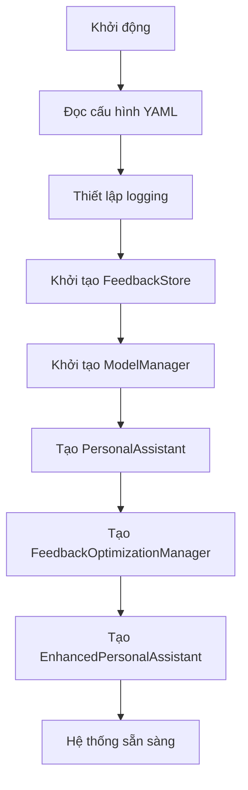
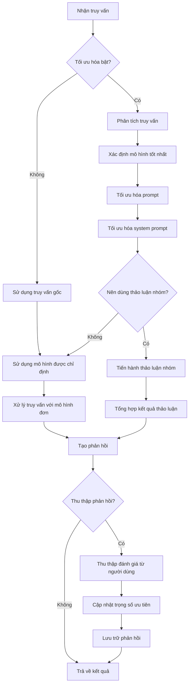
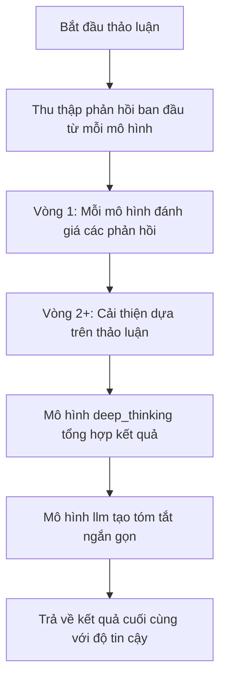
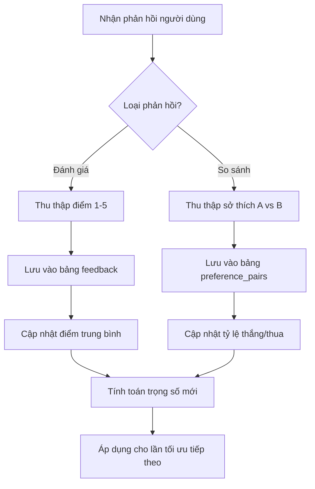
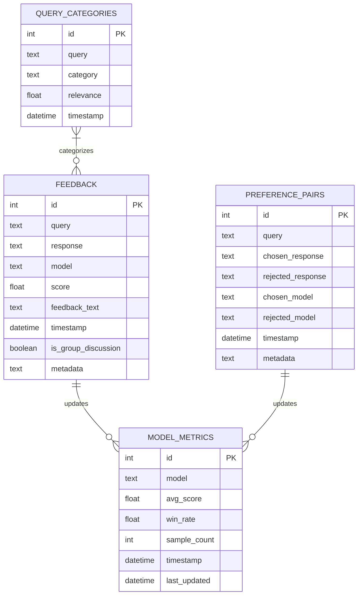

# Kiến trúc hệ thống hỗ trợ cá nhân nâng cao với RLHF và DPO

## Tổng quan kiến trúc

Hệ thống được thiết kế theo kiến trúc phân lớp, với các thành phần được tổ chức thành các module liên kết lỏng, dễ dàng mở rộng và bảo trì.

```
┌───────────────┐     ┌───────────────┐     ┌───────────────┐
│  CLI / API    │     │  Tối ưu hóa   │     │   Ollama API  │
│  Interfaces   │◄───►│  RLHF & DPO   │◄───►│  Model Access │
└───────────────┘     └───────────────┘     └───────────────┘
        ▲                     ▲                     ▲
        │                     │                     │
        └─────────────┬───────┴─────────────┬───────┘
                      │                     │
                      ▼                     ▼
           ┌───────────────────┐  ┌──────────────────┐
           │ Enhanced Assistant│  │Group Discussion   │
           │ Integration       │  │Management         │
           └───────────────────┘  └──────────────────┘
```

## Các lớp chính

### Lớp lõi (Core Layer)

Lớp này chịu trách nhiệm tương tác với các mô hình ngôn ngữ và cung cấp các chức năng cơ bản.

1. **ModelManager**: Quản lý việc tải, kiểm tra và tương tác với các mô hình thông qua Ollama API.
2. **PersonalAssistant**: Lớp cơ sở cung cấp các chức năng trợ lý cá nhân cơ bản.
3. **GroupDiscussionManager**: Quản lý thảo luận nhóm giữa các mô hình.

### Lớp tối ưu hóa (Optimization Layer)

Lớp này triển khai các kỹ thuật RLHF và DPO để cải thiện hiệu suất dựa trên phản hồi người dùng.

1. **FeedbackStore**: Lưu trữ và quản lý dữ liệu phản hồi trong cơ sở dữ liệu SQLite.
2. **PreferenceOptimizer**: Phân tích truy vấn và tối ưu hóa sở thích (DPO).
3. **FeedbackCollector**: Thu thập và xử lý phản hồi từ người dùng (RLHF).
4. **ResponseOptimizer**: Tối ưu hóa prompt và system prompt dựa trên phân tích.
5. **FeedbackOptimizationManager**: Điều phối tất cả các thành phần tối ưu hóa.

### Lớp tích hợp (Integration Layer)

Lớp này kết nối các thành phần lõi với tối ưu hóa, cung cấp trải nghiệm liền mạch.

1. **EnhancedPersonalAssistant**: Mở rộng PersonalAssistant với khả năng RLHF/DPO.
2. **AssistantFactory**: Cung cấp các phương thức factory để tạo và cấu hình các thành phần.

### Lớp giao diện (Interface Layer)

Lớp này cung cấp giao diện người dùng để tương tác với hệ thống.

1. **CLI Modules**: Xử lý tham số dòng lệnh, hiển thị kết quả và báo cáo.
2. **API Modules** (tương lai): Cung cấp RESTful API để tích hợp với các ứng dụng khác.

## Luồng xử lý

### 1. Khởi động hệ thống



### 2. Xử lý truy vấn với RLHF/DPO



### 3. Thảo luận nhóm



### 4. Thu thập và xử lý phản hồi (RLHF)



## Cơ sở dữ liệu SQLite

Hệ thống sử dụng SQLite để lưu trữ dữ liệu phản hồi và cấu hình, bao gồm:



## Quy trình RLHF và DPO

### 1. Quy trình RLHF (Reinforcement Learning from Human Feedback)

RLHF trong hệ thống này thực hiện các bước:

1. **Thu thập phản hồi**: Người dùng cung cấp đánh giá số (1-5 sao) cho các câu trả lời
2. **Lưu trữ phản hồi**: Dữ liệu được lưu trong SQLite với thông tin đầy đủ
3. **Phân tích truy vấn**: Phân loại truy vấn để hiểu loại câu hỏi
4. **Cập nhật metrics**: Điểm trung bình và thống kê được cập nhật
5. **Điều chỉnh trọng số**: Trọng số ưu tiên được điều chỉnh dựa trên phản hồi
6. **Tối ưu hóa prompt**: Điều chỉnh prompt dựa trên loại câu hỏi và phản hồi
7. **Xuất dữ liệu**: Tạo dataset để huấn luyện lại mô hình trong tương lai

### 2. Quy trình DPO (Direct Preference Optimization)

DPO thực hiện các bước:

1. **Thu thập so sánh**: Người dùng chọn câu trả lời tốt hơn giữa hai lựa chọn
2. **Xây dựng ma trận ưu tiên**: Theo dõi mô hình nào thường xuyên được ưu tiên
3. **Tính toán tỷ lệ thắng**: Cập nhật tỷ lệ thắng/thua cho mỗi mô hình
4. **Điều chỉnh trọng số động**: Áp dụng công thức tổng hợp để cập nhật trọng số
5. **Phân tích loại truy vấn**: Xác định mô hình nào tốt hơn cho từng loại câu hỏi
6. **Cập nhật chiến lược lựa chọn**: Tối ưu hóa việc lựa chọn mô hình cho truy vấn mới

## Kiến trúc tối ưu hóa prompt

Hệ thống sử dụng các phương pháp tiên tiến để tối ưu hóa prompt:

1. **Template dynamic**: Chọn template thích hợp dựa trên loại câu hỏi
2. **Phân tích từ khóa**: Xác định chủ đề và ý định dựa trên từ khóa
3. **Tối ưu hóa system prompt**: Điều chỉnh hướng dẫn hệ thống dựa trên phản hồi
4. **Tham số dynamic**: Điều chỉnh temperature và max_tokens theo nhu cầu
5. **Lịch sử thành công**: Sử dụng dữ liệu về cách tiếp cận nào đã thành công

## Mô hình dữ liệu

Hệ thống sử dụng các cấu trúc dữ liệu chính sau:

1. **QueryType**: Phân loại truy vấn với mức độ liên quan của từng danh mục
2. **FeedbackEntry**: Lưu trữ phản hồi từ người dùng
3. **PreferencePair**: Lưu trữ thông tin so sánh giữa hai phản hồi
4. **ModelMetrics**: Lưu trữ hiệu suất của mô hình
5. **OptimizationState**: Theo dõi trạng thái tối ưu hóa hiện tại

## Tích hợp và khả năng mở rộng

Hệ thống được thiết kế để dễ dàng mở rộng:

1. **Thêm mô hình mới**: Chỉ cần cập nhật cấu hình models.yml
2. **API tương lai**: Cấu trúc sẵn sàng cho RESTful API
3. **Tùy chỉnh thu thập phản hồi**: Dễ dàng thay đổi phương pháp thu thập
4. **Tích hợp với các hệ thống khác**: Thông qua các giao diện rõ ràng
5. **Bổ sung ngôn ngữ**: Hỗ trợ đa ngôn ngữ thông qua cấu hình

## Kết luận

Kiến trúc này cung cấp một nền tảng vững chắc cho hệ thống hỗ trợ cá nhân có khả năng tự cải thiện. Bằng cách tách biệt các thành phần và sử dụng thiết kế hướng giao diện, hệ thống có thể dễ dàng mở rộng và cải tiến trong tương lai.